<p align="center">
  
</p>

<h1 align="center">founder-kit</h1>

<p align="center">
  Agent-first founder rhythm. Turn founder intent into agent work, customer signal, and cadence.
</p>

`founder-kit` starts with a small retro terminal animation featuring Scout-01, then prints a daily loop for turning founder judgment into agent-readable work.

## Usage

```sh
npx founder-kit
```

After global install:

```sh
npm install -g founder-kit
founder
```

## Commands

```sh
founder
founder-kit
founder --demo
founder --json
founder --no-animation
```

## Agent-First Loop

```txt
human intent -> agent task -> customer signal -> revenue loop

1. Signal: Point an agent at one real customer thread, call note, or buying signal.
2. Brief: Convert the bottleneck into a crisp task with inputs, limits, and evidence required.
3. Agent: Delegate the smallest useful move an agent can complete or prepare today.
4. Cadence: Review the output, capture the result, and schedule the next human decision.
```

## Development

```sh
npm test
npm run demo
```

## Package Shape

- Package name: `founder-kit`
- CLI commands: `founder`, `founder-kit`
- Mascot: `Scout-01`
- Author: Fractal Research Group LLC
- Website: https://frg.earth
